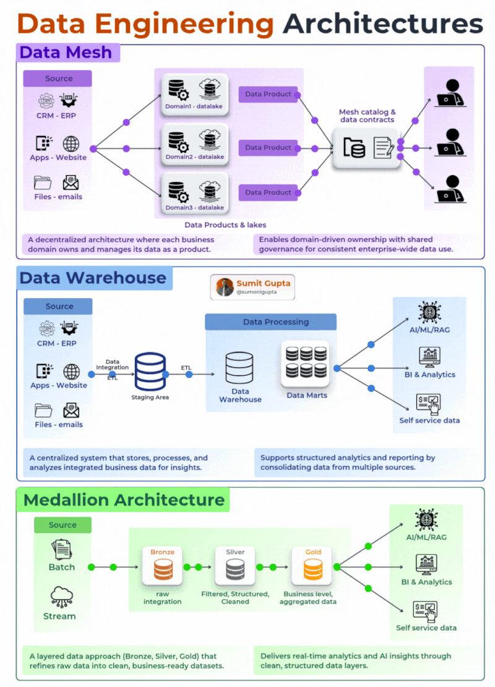

Here are the 3 architectures every data engineer needs to know 👇

━━━━━━━━━━━━━━━━━━━
🔷 𝟭. 𝗗𝗔𝗧𝗔 𝗠𝗘𝗦𝗛 — 𝗗𝗲𝗰𝗲𝗻𝘁𝗿𝗮𝗹𝗶𝘇𝗲𝗱 𝗢𝘄𝗻𝗲𝗿𝘀𝗵𝗶𝗽
━━━━━━━━━━━━━━━━━━━

Forget one central team owning everything.
Data Mesh gives each business domain ownership of its own data — and treats that data as a product.

Your CRM team owns CRM data.
Your marketing team owns marketing data.
A shared mesh catalog + data contracts keep governance consistent across the org.

✅ Best for: Large enterprises, multiple domains, breaking bottlenecks
❌ Avoid if: You're a small team — the overhead isn't worth it

━━━━━━━━━━━━━━━━━━━
🔷𝟮. 𝗗𝗔𝗧𝗔 𝗪𝗔𝗥𝗘𝗛𝗢𝗨𝗦𝗘 — 𝗧𝗵𝗲 𝗥𝗲𝗹𝗶𝗮𝗯𝗹𝗲 𝗖𝗹𝗮𝘀𝘀𝗶𝗰
━━━━━━━━━━━━━━━━━━━

This is where most of us started. And it still delivers.

Source Systems → ETL → Staging → Warehouse → Data Marts → BI & Analytics

Everything is centralized, structured, and queryable.
Your BI team gets clean dashboards. Your data scientists get a single source of truth.

✅ Best for: Structured data, reporting, mature organizations
❌ Avoid if: You need real-time processing or handle unstructured data

━━━━━━━━━━━━━━━━━━━
🔷 𝟯. 𝗠𝗘𝗗𝗔𝗟𝗟𝗜𝗢𝗡 𝗔𝗥𝗖𝗛𝗜𝗧𝗘𝗖𝗧𝗨𝗥𝗘 — 𝗧𝗵𝗲 𝗠𝗼𝗱𝗲𝗿𝗻 𝗦𝘁𝗮𝗻𝗱𝗮𝗿𝗱
━━━━━━━━━━━━━━━━━━━

This has taken over modern data platforms — and for good reason.

🥉 Bronze → Raw data, exactly as it arrived
🥈 Silver → Filtered, cleaned, structured
🥇 Gold → Business-ready, aggregated, curated

Works for both batch AND streaming.
Perfect for lakehouses, AI/ML workloads, and teams that care about data quality at every layer.

✅ Best for: Modern platforms, real-time + batch, AI/ML pipelines
❌ Avoid if: Your pipeline is simple — this adds unnecessary layers

